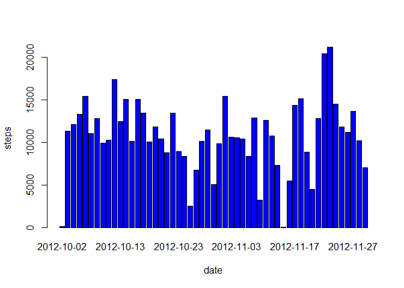
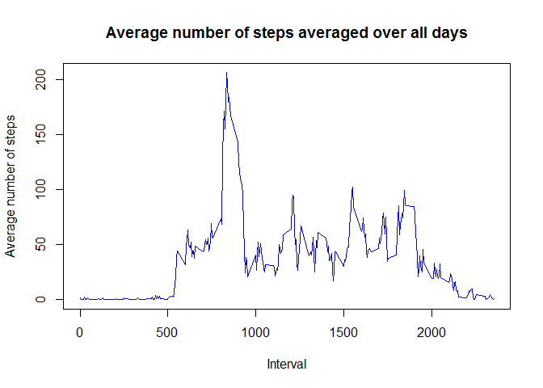
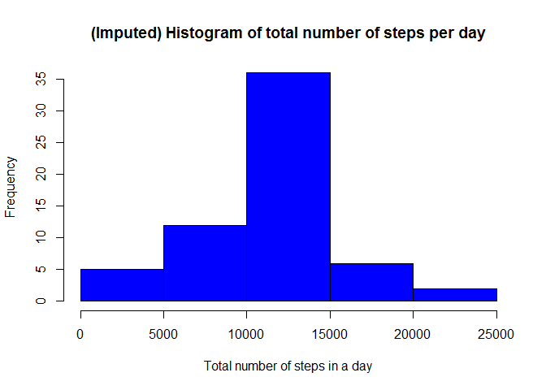
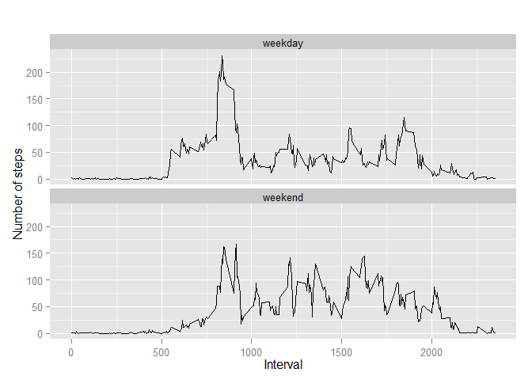

# Reproducible Research: Peer Assessment 1
##Synopsis

This report, I have prepared in context of Reporducible Research Peer Assignment I. 
I am assuming that my data is in current working directory.

## Loading and preprocessing the data

```r
setwd("D:\\download\\RepData_PeerAssessment1")
activityData<-read.csv("activity.csv")
```
- I have imported the data and want to verify how my data looks like

```r
head(activityData)
```

```
##   steps       date interval
## 1    NA 2012-10-01        0
## 2    NA 2012-10-01        5
## 3    NA 2012-10-01       10
## 4    NA 2012-10-01       15
## 5    NA 2012-10-01       20
## 6    NA 2012-10-01       25
```

- Generating basic stat

```r
summary(activityData)
```

```
##      steps                date          interval     
##  Min.   :  0.00   2012-10-01:  288   Min.   :   0.0  
##  1st Qu.:  0.00   2012-10-02:  288   1st Qu.: 588.8  
##  Median :  0.00   2012-10-03:  288   Median :1177.5  
##  Mean   : 37.38   2012-10-04:  288   Mean   :1177.5  
##  3rd Qu.: 12.00   2012-10-05:  288   3rd Qu.:1766.2  
##  Max.   :806.00   2012-10-06:  288   Max.   :2355.0  
##  NA's   :2304     (Other)   :15840
```
- Count number of observations

```r
dim(activityData)
```

```
## [1] 17568     3
```
- Omiting complete cases only

```r
activityData2 <- na.omit(activityData)
```
## What is mean total number of steps taken per day?
- Make a histogram of the total number of steps taken each day

```r
#date_steps <- aggregate(steps ~ date, activityData2, sum)
#hist(table_date_steps$steps, main="Histogram of total number of steps per day", 
#xlab="Total number of steps in a day",ylab = "Frequency", col = "blue",breaks=6)

#barplot(stepsTotalPerDay$steps, names.arg = stepsTotalPerDay$date, xlab = "date", #ylab = "steps")

date_steps <- aggregate(steps ~ date, data = activityData, FUN = sum)
barplot(date_steps$steps, names.arg = date_steps$date, xlab = "date", ylab = "steps",col="blue")
```

 

- Calculate and report the mean total number of steps taken per day


```r
stepsTotalPerDay <- tapply(activityData2$steps, activityData2$date, sum)

round(mean(stepsTotalPerDay,na.rm=TRUE),0)
```

```
## [1] 10766
```
- Calculate and report the median total number of steps taken per day


```r
stepsTotalPerDay <- tapply(activityData2$steps, activityData2$date, sum)

round(median(stepsTotalPerDay,na.rm=TRUE),0)
```

```
## [1] 10765
```

###Results
- The total number of steps mean is 10766.19 and the median is 10765

## What is the average daily activity pattern?
- Make a time series plot (i.e. type = "l") of the 5-minute interval (x-axis) and the average number of steps taken, averaged across all days (y-axis)

```r
# aggregate steps as interval to get average number of steps in an interval across all days
interval_steps <- aggregate(steps ~ interval, activityData2, mean)

# generate the line plot of the 5-minute interval (x-axis) and the average number of 
# steps taken, averaged across all days (y-axis)
plot(interval_steps$interval, interval_steps$steps, type='l',
     col="blue", main="Average number of steps averaged over all days", 
     xlab="Interval", ylab="Average number of steps")
```

 

- Which 5-minute interval, on average across all the days in the dataset, contains the maximum number of steps?


```r
# find row id of maximum average number of steps in an interval
max_ave_steps_row_id <- which.max(interval_steps$steps)

# get the interval with maximum average number of steps in an interval
interval_steps [max_ave_steps_row_id, ]
```

```
##     interval    steps
## 104      835 206.1698
```

###Results
- The daily average activity maxed on the 5 min interval starting at 08:35 averaging 206 steps
## Imputing missing values
- Calculate and report the total number of missing values in the dataset (i.e. the total number of rows with NAs)

- Devise a strategy for filling in all of the missing values in the dataset. The strategy does not need to be sophisticated. For example, you could use the mean/median for that day, or the mean for that 5-minute

- Create a new dataset that is equal to the original dataset but with the missing data filled in.

- Make a histogram of the total number of steps taken each day and Calculate and report the mean and median total number of steps taken per day. Do these values differ from the estimates from the first part of the assignment? What is the impact of imputing missing data on the estimates of the total daily number of steps?


```r
sum(as.numeric(is.na(activityData$steps)))
```

```
## [1] 2304
```


```r
# perform the imputation
for (i in 1:nrow(activityData)){
  if (is.na(activityData$steps[i])){
    interval_val <- activityData$interval[i]
    row_id <- which(interval_steps$interval == interval_val)
    steps_val <- interval_steps$steps[row_id]
    activityData$steps[i] <- steps_val
  }
}

# aggregate steps as per date to get total number of steps in a day
date_steps_imputed <- aggregate(steps ~ date, activityData, sum)

# create histogram of total number of steps in a day
hist(date_steps_imputed$steps, col="blue", main="(Imputed) Histogram of total number of steps per day", xlab="Total number of steps in a day")
```

 

```r
# get mean and median of total number of steps per day
mean(date_steps_imputed$steps)
```

```
## [1] 10766.19
```

```r
median(date_steps_imputed$steps)
```

```
## [1] 10766.19
```

```r
# get mean and median of total number of steps per day for data with NA's removed
mean(date_steps$steps)
```

```
## [1] 10766.19
```

```r
median(date_steps$steps)
```

```
## [1] 10765
```


## Are there differences in activity patterns between weekdays and weekends?

- Create a new factor variable in the dataset with two levels - "weekday" and "weekend" indicating whether a given date is a weekday or weekend day.

- Make a panel plot containing a time series plot (i.e. type = "l") of the 5-minute interval (x-axis) and the average number of steps taken, averaged across all weekday days or weekend days (y-axis).


```r
# convert date from string to Date class
activityData$date <- as.Date(activityData$date, "%Y-%m-%d")


# add a new column indicating day of the week 
activityData$day <- weekdays(activityData$date)

# add a new column called day type and initialize to weekday
activityData$day_type <- c("weekday")

# If day is Saturday or Sunday, make day_type as weekend
for (i in 1:nrow(activityData)){
  if (activityData$day[i] == "Saturday" || activityData$day[i] == "Sunday"){
    activityData$day_type[i] <- "weekend"
  }
}

# convert day_time from character to factor
activityData$day_type <- as.factor(activityData$day_type)

# aggregate steps as interval to get average number of steps in an interval across all days
table_interval_steps_imputed <- aggregate(steps ~ interval+day_type, activityData, mean)

# make the panel plot for weekdays and weekends
library(ggplot2)

qplot(interval, steps, data=table_interval_steps_imputed, geom=c("line"), xlab="Interval", ylab="Number of steps", main="") + facet_wrap(~ day_type, ncol=1)
```

 

###Conclusion
In above chart the weekly activity tend to be more spread, while weekday activities are peaking early morning, this may be due to preparation for work day and tends to rise a bit after the work day. When activity during weekday is ebb after 20:00, during weekend activity is still high for an hour longer.
